# Legendary Cruises

A full-stack ticket booking application developed with **ASP.NET Core Blazor Server**

This project combines the modern capabilities of ASP.NET Core Blazor Server with a clean, responsive user interface to deliver a fast and enjoyable ticket‑booking experience for customers, while giving administrators full control over cruise management.

The platform is designed to:

Simplify the booking process with an interactive and user‑friendly UI.

Automate customer service through QR code generation and email delivery of digital tickets.

Streamline offer management using a complete admin panel with full CRUD functionality.

Ensure security and reliability thanks to ASP.NET Core Identity integration.

Be scalable and production‑ready, built on clean architecture and EF Core.

---

## 📝 Description

**Legendary Cruises** is a comprehensive solution designed for booking and managing tickets for cruises. The repository consists of a web platform for users and administrators.

---

## 🛠️ Technologies

- **Web Framework:** ASP.NET Core Blazor Server
- **Database & ORM:** Entity Framework Core, Microsoft SQL Server
- **Authentication & Security:** ASP.NET Core Identity
- **Integrations & Utilities:**  SMTP Email Service

---

## ✨ Features

* **User Authentication:** Registration, login, and access control powered by ASP.NET Core Identity.
* **Ticket Reservation:** Interactive browsing and booking system for cruises.
* **QR Code Generation:** Automatic creation of unique QR codes for purchased tickets.
* **Admin Management Panel:** Dashboard for managing cruises and booking.
* **Email Notifications:** Automatic confirmation of payment and delivery of digital tickets via SMTP email service directly to the user's inbox.

---


## 📂 Architecture

                    ┌─────────────────────┐
                    │   Blazor Server     │
                    │   Web Application   │
                    └──────────┬──────────┘
                               │
                    ┌──────────▼──────────┐
                    │   ASP.NET Core       │
                    │   Identity / EF Core │
                    └──────────┬──────────┘
                               │
                    ┌──────────▼──────────┐
                    │    SQL Server       │
                    └─────────────────────┘


       
      
      
      
     

## ⚙️ QR Codes

 
       QR codes in Legendary Cruises are generated automatically for every purchased ticket. Each code contains a unique, secure identifier that allows the system to verify the authenticity of the reservation. The process is fully automated and integrated with the checkout and email delivery flow.

🔐 Step-by-step flow
Ticket creation — When a user completes a purchase, the system creates a ticket record in the database with a unique GUID.

QR code generation — The application uses a QR code library to encode the ticket’s unique identifier into a scannable image.

Email delivery — The generated QR code is attached to the confirmation email and sent to the user via the configured SMTP service.

Verification — When scanned (e.g., during boarding), the QR code resolves to the ticket ID, allowing the system to validate the reservation and check its status in real time. 


## ⚙️ Getting Started

### Prerequisites

- [.NET 8.0 SDK](https://dotnet.microsoft.com/download) (or latest supported version)
- [Microsoft SQL Server](https://www.microsoft.com/sql-server)
- Visual Studio 2022 (with *ASP.NET and web development* and *.NET Multi-platform App UI development* workloads)

### Installation & Setup

1. **Clone the repository:**
   ```bash
   git clone https://github.com/aczupa/LegendaryCruises.git
  
   ```

2. **Configure the database connection and SMTP settings:** create or update `LegendaryCruises/appsettings.json` as shown in the [Configuration](#-configuration-appsettingsjson) section below.

3. **Apply database migrations:**
   ```bash
   dotnet ef database update --project LegendaryCruises
   ```

4. **Run the web application:**
   ```bash
   dotnet run --project LegendaryCruises
   ```


## ⚙️ Configuration (`appsettings.json`)

Create or update the `LegendaryCruises/appsettings.json` file with your local database connection string and SMTP settings for sending emails:

```json
{
  "ConnectionStrings": {
    "DefaultConnection": "Server=YOUR_SERVER_NAME;Database=LegendaryCruises;Trusted_Connection=True;Encrypt=False;TrustServerCertificate=True;"
  },
  "SmtpOptions": {
    "Host": "smtp.gmail.com",
    "Port": 587,
    "Username": "your-email@gmail.com",
    "Password": "YOUR_APP_PASSWORD",
    "From": "your-email@gmail.com",
    "FromName": "Legendary Cruises Ticket"
  },
  "Logging": {
    "LogLevel": {
      "Default": "Information",
      "Microsoft.AspNetCore": "Warning"
    }
  },
  "AllowedHosts": "*"
}
```

## 📸 Screenshots

### Home & Reservation

| Home | Reservation Ticket |
|------|---------------------|
| 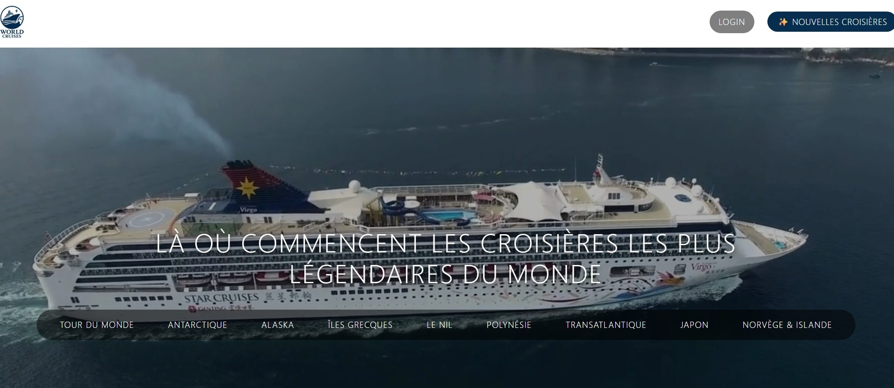 | 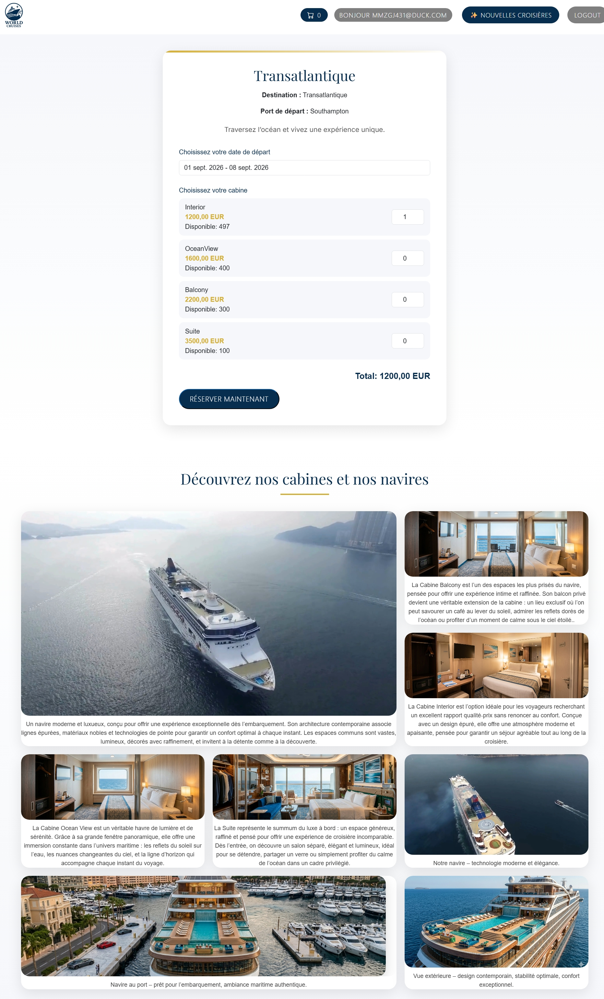 |


### Admin Panel
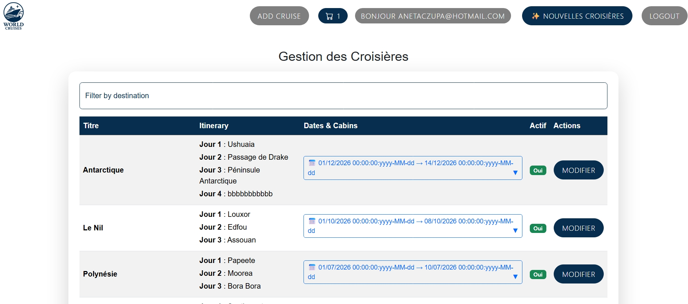
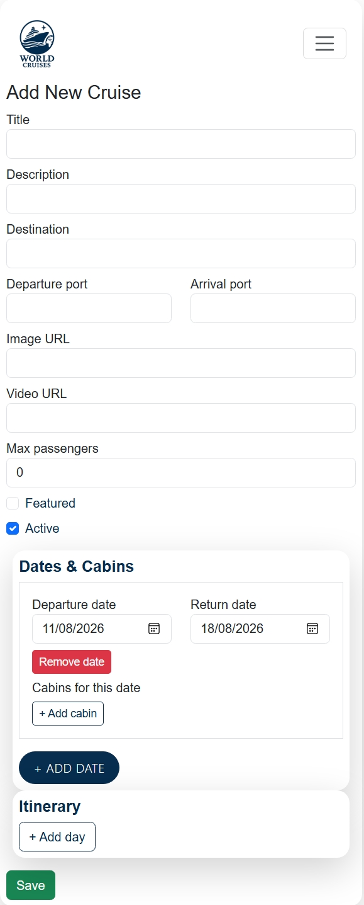
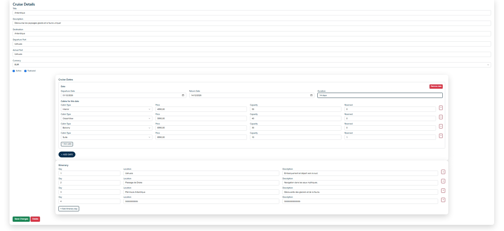
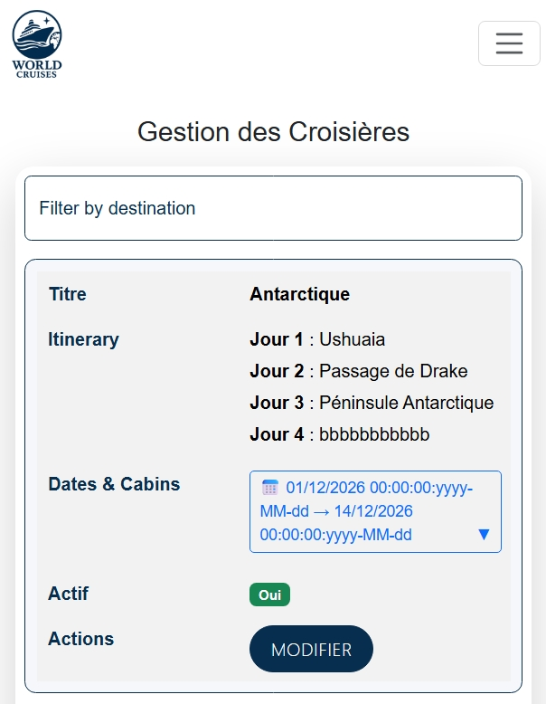

### Cart & Checkout
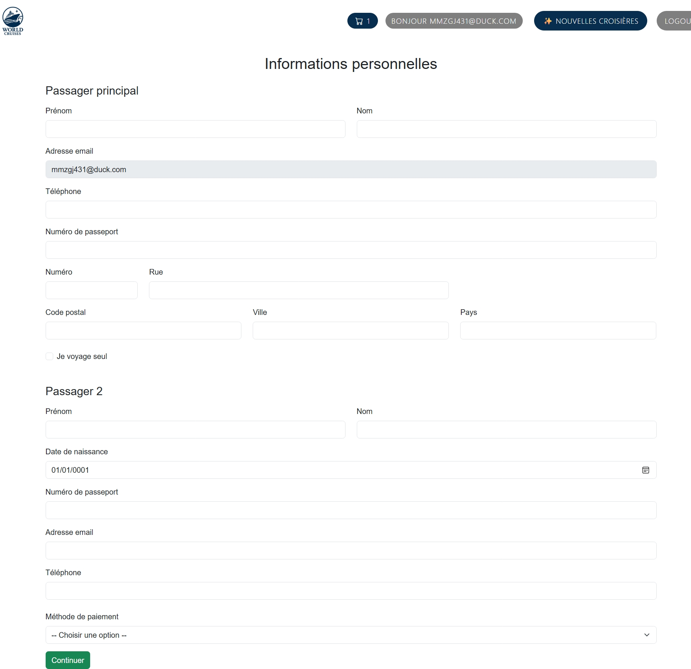
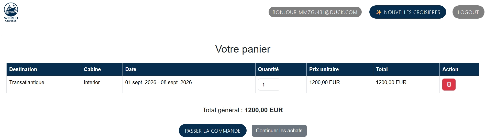
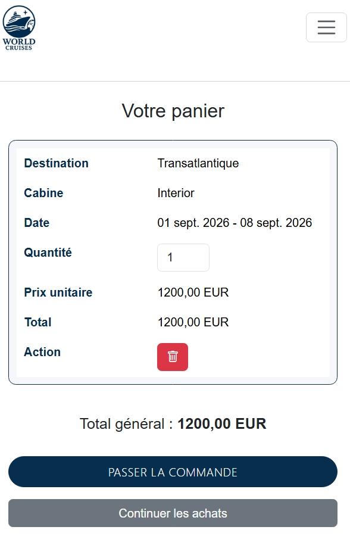


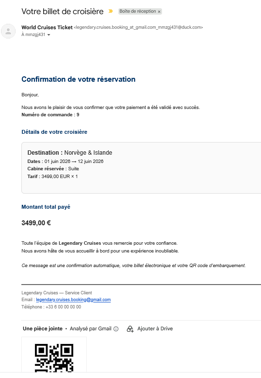
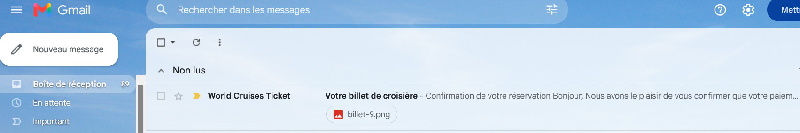

### Responsive View (Mobile)

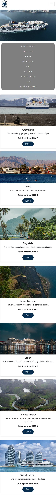 
